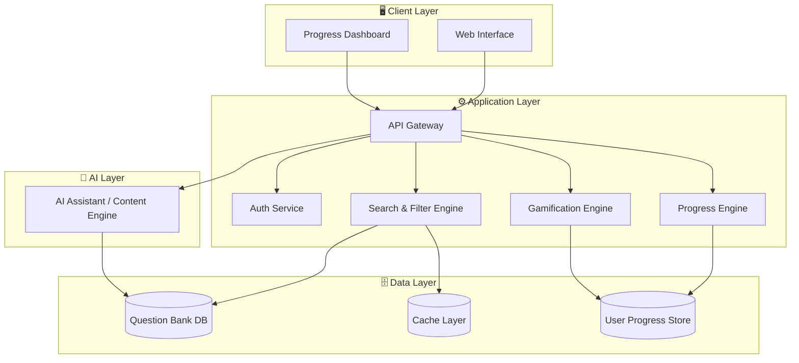
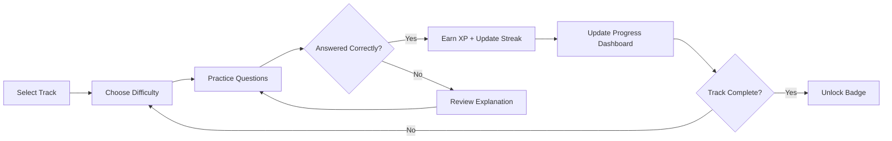
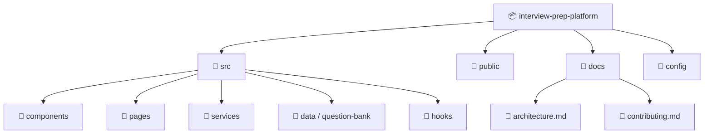
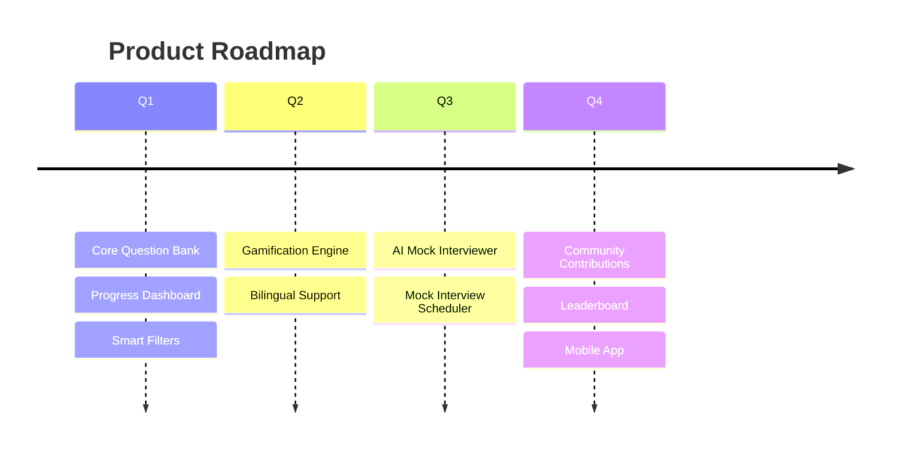

<div align="center">

<!-- ============================== HERO ============================== -->


<br/>

<a href="#">
  
</a>

<br/><br/>

<!-- ============================== BADGES ============================== -->

<p>
  
  
  
  
</p>

<p>
  /<your-repo>?style=for-the-badge&color=FFD700&logo=github" />
  /<your-repo>?style=for-the-badge&color=blue&logo=github" />
  /<your-repo>?style=for-the-badge&color=orange&logo=github" />
  /<your-repo>?style=for-the-badge&color=violet&logo=github" />
</p>

<p>
  &label=Repository%20Views&color=0e75b6&style=for-the-badge" alt="visitor badge"/>
</p>

<br/>

<a href="#-live-demo"></a>
<a href="#-installation"></a>
<a href="#-contributing"></a>

</div>

<br/>


<br/>

## 📖 Quick Overview

<table>
<tr>
<td width="50%" valign="top">

### 🎯 What is this?

**Interview Preparation Platform** is a structured, trackable, and gamified prep environment built for engineers targeting **senior full-stack**, **ERPNext/Frappe**, **AI engineering**, and **DevOps / system design** roles.

It replaces scattered notes and browser tabs with one focused workspace: curated questions, guided learning paths, progress analytics, and negotiation playbooks — all in one place.

</td>
<td width="50%" valign="top">

### 🧩 Who is it for?

- 👨‍💻 Senior Full-Stack Engineers
- 🏗️ ERPNext / Frappe Developers
- 🤖 AI & Automation Engineers
- 🛠️ DevOps & Platform Engineers
- 🎙️ Anyone preparing for HR rounds & salary negotiation

</td>
</tr>
</table>

<br/>

<div align="center">

### 📊 At a Glance

| 🧠 Question Bank | 🗂️ Categories | 📈 Progress Tracking | 🏆 Gamification | 🌐 Bilingual |
|:---:|:---:|:---:|:---:|:---:|
| Curated & Growing | 10+ Domains | Real-Time Analytics | XP · Streaks · Badges | AR / EN Ready |

</div>


<br/>

## 🚀 Live Demo

<div align="center">

> 🔧 **Configurable placeholder** — replace with your deployed URL once available.

[](https://your-live-demo-url.example.com)

</div>

<br/>

## ✨ Features

<table>
<tr>
<td width="33%" valign="top">

### 🧠 Smart Question Bank
Curated, categorized interview questions spanning system design, coding, ERPNext/Frappe internals, AI engineering, and behavioral/HR rounds.

</td>
<td width="33%" valign="top">

### 📊 Learning Progress
Visual dashboards track completion rate, weak areas, and revision cadence — so you always know what to study next.

</td>
<td width="33%" valign="top">

### 🏆 Gamification
Earn XP, maintain streaks, and unlock achievement badges as you progress through each track.

</td>
</tr>
<tr>
<td width="33%" valign="top">

### 🔍 Smart Filters & Search
Instantly filter by role, seniority level, technology, or difficulty to build a focused practice session.

</td>
<td width="33%" valign="top">

### 💬 Salary Negotiation Playbook
Structured scripts and frameworks for compensation discussions and offer negotiation.

</td>
<td width="33%" valign="top">

### 🌍 Bilingual Ready
Interface and content structured to support Arabic/English delivery for regional candidates.

</td>
</tr>
</table>

<br/>

<details>
<summary><b>📋 Full Feature Checklist (click to expand)</b></summary>
<br/>

- [x] Categorized interview question bank
- [x] System design & architecture track
- [x] ERPNext / Frappe specialist track
- [x] AI engineering & automation track
- [x] DevOps & infrastructure track
- [x] Leadership & behavioral track
- [x] HR interview simulation track
- [x] Salary negotiation guides
- [x] Progress dashboard & analytics
- [x] Gamified XP / streak system
- [x] Smart search & filtering
- [ ] Mock interview scheduler *(roadmap)*
- [ ] AI-powered mock interviewer *(roadmap)*
- [ ] Community-submitted questions *(roadmap)*

</details>


<br/>

## 🏗️ Architecture



<br/>

<details>
<summary><b>🔄 Learning Flow (click to expand)</b></summary>



</details>

<details>
<summary><b>📁 Project Structure (click to expand)</b></summary>



</details>


<br/>

## 🛠️ Technology Stack

<div align="center">


<br/><br/>

**ERP & Business Platform**
<br/>


<br/>

**AI & Automation**
<br/>


</div>

<br/>

<div align="center">

| Layer | Technologies |
|---|---|
| **Frontend** | HTML5 · CSS3 · JavaScript · React |
| **Backend** | Node.js · Python · PHP · Laravel |
| **ERP Core** | ERPNext · Frappe Framework |
| **AI / Automation** | OpenAI API · Claude API · n8n Workflows |
| **Data** | PostgreSQL · MariaDB · Redis |
| **Infrastructure** | Docker · Linux · Git / GitHub |

</div>


<br/>

## 📸 Screenshots

<div align="center">

> 🔧 **Configurable placeholder** — add real screenshots under `/docs/screenshots/` and update the paths below.

| Dashboard | Question Practice | Progress Analytics |
|:---:|:---:|:---:|
|  |  |  |

</div>

<br/>

## 🗂️ Interview Categories

<div align="center">

| Category | Focus | Level |
|---|---|:---:|
| 🏗️ System Design | Scalability, distributed systems, trade-offs | Senior |
| 💻 Full-Stack Engineering | Frontend, backend, integration patterns | Mid–Senior |
| 🧩 ERPNext / Frappe | Doctypes, hooks, customization, deployment | Specialist |
| 🤖 AI Engineering | LLM integration, prompting, automation pipelines | Mid–Senior |
| ⚙️ DevOps | CI/CD, containers, infrastructure, monitoring | Mid–Senior |
| 👥 Leadership | Team management, mentorship, conflict resolution | Senior |
| 🎙️ HR & Behavioral | STAR method, culture-fit, motivation | All Levels |
| 💰 Salary Negotiation | Offer evaluation, counter-offer strategy | All Levels |

</div>


<br/>

## 📈 Dashboard Preview

<table>
<tr>
<td width="50%" valign="top">

### 🎯 Progress at a Glance

```
System Design      ████████░░  80%
ERPNext / Frappe   ██████░░░░  60%
AI Engineering      █████████░  90%
DevOps              ████░░░░░░  40%
Leadership          ███████░░░  70%
```

</td>
<td width="50%" valign="top">

### 🏆 Gamification Snapshot

- 🔥 Current Streak: **12 days**
- ⭐ XP Earned: **2,450**
- 🎖️ Badges Unlocked: **7 / 15**
- 📚 Questions Practiced: **340**

</td>
</tr>
</table>

<br/>

## 🔍 Search System

> Filter by **role**, **seniority**, **technology**, or **difficulty** to instantly surface the most relevant questions — no more scrolling through irrelevant content.

```
🔎  [ system design ]  🏷️ Senior  🧩 Distributed Systems  ⏱️ 15 results
```

<br/>

## 🎮 Gamification

<div align="center">

| Mechanic | Description |
|---|---|
| ⭐ **XP System** | Earn experience points for every completed question |
| 🔥 **Streaks** | Build daily practice streaks to stay consistent |
| 🎖️ **Badges** | Unlock achievements for completing tracks and milestones |
| 🏅 **Leaderboard** | *(Roadmap)* Compare progress with peers |

</div>


<br/>

## 🗺️ Roadmap



<details>
<summary><b>🔮 Future Plans (click to expand)</b></summary>
<br/>

- [ ] AI-powered mock interviewer with real-time feedback
- [ ] Scheduling system for peer mock interviews
- [ ] Community-submitted and peer-reviewed question bank
- [ ] Native mobile app (iOS / Android)
- [ ] Public leaderboard & cohort challenges
- [ ] Company-specific interview tracks

</details>


<br/>

## ⚡ Installation

```bash
# Clone the repository
git clone https://github.com/<your-username>/<your-repo>.git

# Navigate into the project
cd <your-repo>

# Install dependencies
npm install

# Configure environment variables
cp .env.example .env

# Start the development server
npm run dev
```

<br/>

## 🖱️ Usage

```bash
# Run the platform locally
npm run dev

# Build for production
npm run build

# Run tests
npm run test
```

<br/>

## 🎨 Customization

<details>
<summary><b>⚙️ Configuration Options (click to expand)</b></summary>
<br/>

- **Question Bank** — add or edit entries under `src/data/question-bank/`
- **Themes** — adjust design tokens in `src/styles/theme.config`
- **Language** — toggle Arabic/English content sets in `src/i18n/`
- **Gamification Rules** — tune XP and streak logic in `src/services/gamification/`

</details>


<br/>

## 🤝 Contributing

<div align="center">

Contributions, issues, and feature requests are welcome!

[](CONTRIBUTING.md)

</div>

1. Fork the project
2. Create your feature branch (`git checkout -b feature/amazing-feature`)
3. Commit your changes (`git commit -m 'Add amazing feature'`)
4. Push to the branch (`git push origin feature/amazing-feature`)
5. Open a Pull Request

<br/>

## 🔒 Security

If you discover a security vulnerability, please open a private security advisory or contact the maintainer directly rather than opening a public issue. See `SECURITY.md` for full details.

<br/>

## ⚙️ Performance

<div align="center">

| Metric | Target |
|---|---|
| Initial Load | < 2s |
| Search Response | < 100ms |
| Lighthouse Score | 90+ |

</div>

<br/>

## 📄 License

This project is licensed under the **MIT License** — see the [LICENSE](LICENSE) file for details.

<br/>

## 👤 Author

<div align="center">

**Mo** — Senior Full-Stack Developer & Technical Co-Founder

> 🔧 **Configurable placeholder** — add your GitHub, LinkedIn, and portfolio links below.

[](https://github.com/<your-username>)
[](https://linkedin.com/in/<your-profile>)
[](https://your-portfolio-url.example.com)

</div>

<br/>

## 💖 Support

<div align="center">

If this project helped you, consider giving it a ⭐ — it helps others discover it too.

[](https://github.com/<your-username>/<your-repo>)

</div>

<br/>

## 📊 Repository Insights

<div align="center">

&repo=<your-repo>&show_owner=true&theme=tokyonight&hide_border=true" />

<br/>

&repo=<your-repo>&layout=compact&theme=tokyonight&hide_border=true" />

<br/>

&theme=tokyonight&hide_border=true" />

</div>

<br/>

## ⭐ Star History

<div align="center">

[](https://star-history.com/#<your-username>/<your-repo>&Date)

</div>

<br/>

## ❓ FAQ

<details>
<summary><b>Is this platform free to use?</b></summary>
<br/>
Yes — the core platform is open source under the MIT License.
</details>

<details>
<summary><b>Can I add my own interview questions?</b></summary>
<br/>
Yes — the question bank is fully extensible. See the Customization section above.
</details>

<details>
<summary><b>Does it support Arabic content?</b></summary>
<br/>
Yes — the platform is built with bilingual Arabic/English support in mind.
</details>

<details>
<summary><b>Is there an AI-powered mock interviewer?</b></summary>
<br/>
It's on the roadmap. Track progress in the Roadmap section above.
</details>

<br/>

<div align="center">


**Built with ❤️ for engineers leveling up their careers.**

</div>
